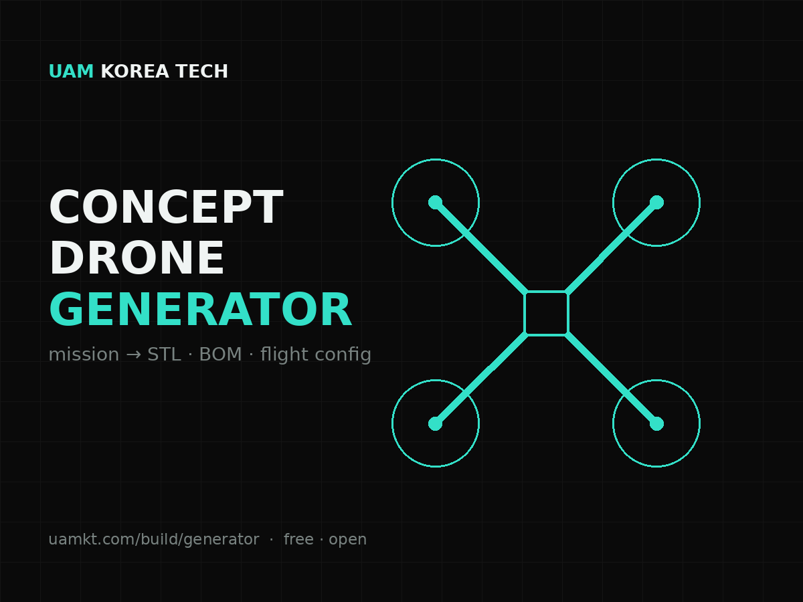

  

<h1 align="center">Concept Drone Generator</h1>

  <b>Enter a mission and payload — get a printable concept frame (STL), a reference BOM, a flight-stack starter config, and an assembly card.</b> 
  A free tool by <a href="https://www.uamkt.com">UAM Korea Tech</a> · part of <b>UAMKT Open Studio</b>.

  ▶ <b>Live tool:</b> <a href="https://www.uamkt.com/build/generator">uamkt.com/build/generator</a> &nbsp;·&nbsp;
  🇰🇷 <a href="https://www.uamkt.com/ko/build/generator">한국어</a>

---

## What it does

Purpose-built drones start with a decision, not a shopping cart. This tool turns a **mission + payload** into a starting point you can actually build:

- **Airframe class** (e.g. X500 ↔ X650) sized to payload and endurance
- **AUW estimate**, per-motor thrust for a 2:1 thrust-to-weight target, battery estimate
- **Reference BOM** with indicative pricing (CSV export)
- **Flight-stack recommendation** — ArduPilot (GPLv3) for auditable/research builds, PX4 (BSD-3) for closed commercial products — with a starter config (TXT export)
- **Printable concept X-frame** (STL export) + a top-view preview
- **Assembly card** you can hand to a technician

> The generator is a **starting point and teaching aid**, not a validated flight design.

## Files in this package

| File | Purpose |
|------|---------|
| `makerworld/uamkt-concept-quad-500.stl` | Sample concept quad frame (500 mm class) |
| `makerworld/uamkt-concept-hexa-650.stl` | Sample concept hexa frame (650 mm class) |
| `makerworld/thumbnail-4x3.png` / `thumbnail-1x1.png` | Listing thumbnails |
| `MAKERWORLD.md` | Copy-paste listing text for MakerWorld / Printables |
| `LICENSE` | MIT — for any code |
| `DESIGNS-LICENSE.md` | CC BY 4.0 — for generated STL designs |

## Quick start (print the sample)

1. Download `uamkt-concept-quad-500.stl`.
2. Slice with 0.2 mm layers, 4 walls, 40–60% infill (PETG or PLA+ recommended).
3. This is a **concept/education frame** — not a flight-certified structure.

## Build it for real

The full build methodology — flight stacks, hardware sizing, procurement, calibration — is documented openly at [uamkt.com/build](https://www.uamkt.com/build) and in the **Dronology** e-book series on Amazon: [uamkt.com/publications/books](https://www.uamkt.com/publications/books).

Working on a mission that needs sensors, autonomy, or airspace integration? [Talk to us](https://www.uamkt.com/contact/general).

## Safety & IP

- Figures, parts and prices are **illustrative (verify before use)**.
- 3D-printed structural parts and **propellers are experimental**; use certified props and airframes for actual flight.
- Operation requires national airworthiness rules and radio-frequency (KC) certification.
- ArduPilot, PX4, Holybro, NVIDIA, Pixhawk are trademarks of their respective owners (unaffiliated third-party references).
- This project is **not legal or safety advice**.

## License

- **Code:** [MIT](LICENSE)
- **Generated designs (STL):** [CC BY 4.0](DESIGNS-LICENSE.md) — remix and use freely, just credit *UAM Korea Tech (uamkt.com)*.

---

UAM Korea Tech · Low-altitude airspace solutions · <a href="https://www.uamkt.com">uamkt.com</a>

